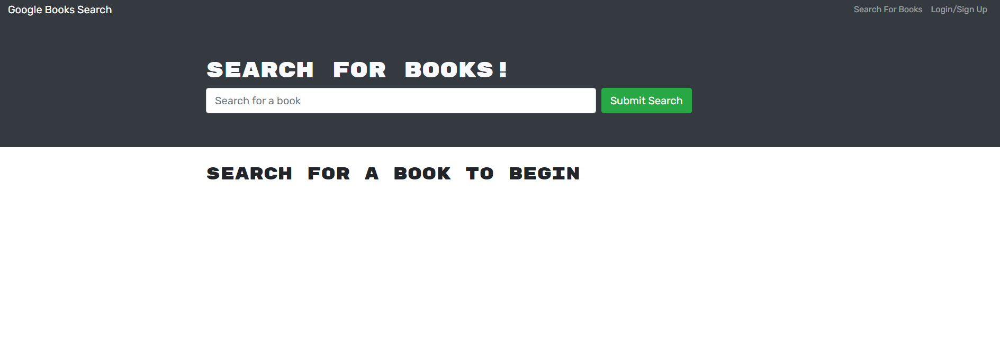

# Book_Search_Engine_MERN-21

## Description
With the starter code with a fully functioning Google Books API search engine built with a RESTful API, I refactored it to be a GraphQL API built with Apollo Server. The app was built using the MERN stack with a React front end, MongoDB database, and Node.js/Express.js server and API. It's already set up to allow users to save book searches to the back end.

## Criteria
* By loading the search engine, yoou're presented with a menu with the options Search for Books and Login/Signup and an input field to search for books and a submit button
* By clicking on the Search for Books menu option, you're presented with an input field to search for books and a submit button
* If you're not logged in and enter a search term in the input field and click the submit button, then you're presented with several search results, each featuring a book’s title, author, description, image, and a link to that book on the Google Books site
* By clicking on the Login/Signup menu option, a modal appears on the screen with a toggle between the option to log in or sign up
* When the toggle is set to Signup, then you're presented with three inputs for a username, an email address, and a password, and a signup button
* When the toggle is set to Login, then you're presented with two inputs for an email address and a password and login button
* By entering a valid email address and create a password and click on the signup button, then your user account is created and you're logged in to the site
* By entering your account’s email address and password and click on the login button, then the modal closes and you're logged in to the site
* When you're logged in to the site, then the menu options change to Search for Books, an option to see your saved books, and Logout
* When you're logged in and enter a search term in the input field and click the submit button, you're presented with several search results, each featuring a book’s title, author, description, image, and a link to that book on the Google Books site and a button to save a book to my account
* By clicking on the Save button on a book, that book’s information is saved to your account
* By clicking on the option to see your saved books, then you're presented with all of the books you have saved to your account, each featuring the book’s title, author, description, image, and a link to that book on the Google Books site and a button to remove a book from my account
* By clicking on the Remove button on a book, that book is deleted from your saved books list
* By clicking on the Logout button,then you're logged out of the site and presented with a menu with the options Search for Books and Login/Signup and an input field to search for books and a submit button  

## Installation
* Copy the repository to your system
* Create .env file
     - SET MONGODB_URI to mongoDB URI
* npm install
* npm run dev

## Technologies
* MongoDB
* Express
* React
* Node
* GrpahQL

## Link
* [Heroku Deployed Page](https://book-search-enginee-hw.herokuapp.com/)

## Application Preview
